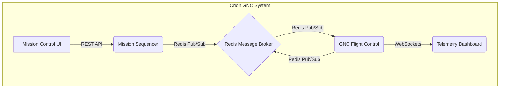

# Orion GNC Restoration Architecture

This document outlines the architecture for the Orion GNC (Guidance, Navigation, and Control) autonomous mission operations system. It describes the system components, communication patterns, and deployment strategies.

## 1. Overview

The Orion GNC system is a microservices-based architecture designed for autonomous mission operations. It enables mission sequencing, flight control, real-time monitoring, and user interaction through a set of independent, scalable services. The system is designed to be resilient and fault-tolerant, ensuring high availability during critical mission phases.

## 2. System Components

The system is composed of the following microservices:

*   **Mission Sequencer:** Orchestrates mission plans by sending commands to the GNC Flight Control service.
*   **GNC Flight Control:** Executes flight control logic based on commands from the Mission Sequencer.
*   **Mission Control UI:** A web-based interface for operators to manage and monitor missions.
*   **Telemetry Dashboard:** A real-time dashboard for visualizing telemetry data from the GNC Flight Control service.
*   **Redis Message Broker:** Facilitates asynchronous communication between services using a publish/subscribe model.

## 3. Architecture Diagrams

### Component Diagram

This diagram shows the high-level architecture of the system and the relationships between the services.



### Sequence Diagram

This diagram illustrates the data flow for a typical mission scenario.

```mermaid
sequenceDiagram
    participant MCUI as Mission Control UI
    participant MS as Mission Sequencer
    participant RMB as Redis Message Broker
    participant GNC as GNC Flight Control
    participant TD as Telemetry Dashboard

    MCUI->>+MS: POST /api/missions (Start Mission)
    MS->>+RMB: PUBLISH mission_commands
    RMB->>+GNC: Subscribes to mission_commands
    GNC-->>-RMB: PUBLISH telemetry_data
    RMB-->>-TD: Subscribes to telemetry_data
    TD-->>MCUI: Real-time telemetry updates
    GNC-->>-MS: Mission status updates (via Redis)
    MS-->>-MCUI: Mission status updates (via WebSockets)
```

## 4. Communication Patterns

The system uses a combination of communication patterns to ensure efficient and reliable data exchange.

*   **REST APIs:** Synchronous communication for user-initiated actions, such as starting a mission from the Mission Control UI.
*   **Redis Pub/Sub:** Asynchronous messaging for decoupling services. The Mission Sequencer publishes commands, and the GNC Flight Control service subscribes to them.
*   **WebSockets:** Real-time, bidirectional communication for streaming telemetry data from the GNC Flight Control service to the Telemetry Dashboard.

## 5. API Specifications

### Mission Sequencer API

*   **Endpoint:** `POST /api/missions`
*   **Description:** Starts a new mission.
*   **Payload:**
    ```json
    {
      "mission_id": "mission-123",
      "commands": [
        { "command": "SET_ATTITUDE", "parameters": { "pitch": 15, "yaw": 90 } },
        { "command": "ORBIT_ADJUST", "parameters": { "delta_v": 50 } }
      ]
    }
    ```

### GNC Flight Control (via Redis)

*   **Channel:** `mission_commands`
*   **Description:** Receives commands from the Mission Sequencer.
*   **Payload:**
    ```json
    { "command": "SET_ATTITUDE", "parameters": { "pitch": 15, "yaw": 90 } }
    ```

*   **Channel:** `telemetry_data`
*   **Description:** Publishes telemetry data.
*   **Payload:**
    ```json
    { "timestamp": "2023-10-27T10:00:00Z", "altitude": 500, "velocity": 7800 }
    ```

## 6. Deployment Architecture

The system is designed for containerized deployment using Docker. Each microservice has its own Dockerfile, and a `docker-compose.yml` file is used to orchestrate the services for local development and testing. For production, a container orchestration platform like Kubernetes is recommended.

## 7. Error Handling and Fault Tolerance

*   **Service Redundancy:** Multiple instances of each service can be deployed to ensure high availability.
*   **Circuit Breaker:** A circuit breaker pattern can be implemented to prevent network failures from cascading.
*   **Message Queues:** Redis queues provide durability for messages, ensuring that commands are not lost if a service is temporarily unavailable.
*   **Health Checks:** Each service exposes a `/health` endpoint for monitoring its status.