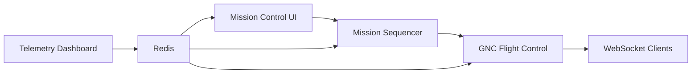

# Orion GNC System Integration Tests

## Overview

This comprehensive integration test suite validates the complete system communication flow after our critical SPARC orchestration bug fixes. These tests serve as the final validation that our system successfully resolved all critical failures identified in [`next-steps.md`](../../next-steps.md).

## Critical Issues Validated

### 1. Mission Control UI Gunicorn Configuration Fix
- **Issue**: `gunicorn: error: argument -w/--workers: invalid int value: '$GUNICORN_WORKERS'`
- **Fix**: Updated [`mission-control-ui/Dockerfile`](../../mission-control-ui/Dockerfile) to use shell form for CMD
- **Test**: [`test_mission_control_ui_gunicorn_startup_fix()`](test_system_integration.py)

### 2. GNC Flight Control WebSocket TypeError Fix
- **Issue**: `TypeError: websocket_handler() missing 1 required positional argument: 'path'`
- **Fix**: Updated [`gnc-flight-control/main.py`](../../gnc-flight-control/main.py) handler signature
- **Test**: [`test_gnc_flight_control_websocket_connection_fix()`](test_system_integration.py)

### 3. WebSocket Handshake Validation
- **Issue**: WebSocket handshake failures during health checks
- **Fix**: Proper WebSocket server implementation
- **Test**: [`test_websocket_telemetry_broadcasting()`](test_system_integration.py)

## Test Architecture

### Test Categories

1. **Docker Compose Integration**
   - Validates system startup without previous failures
   - Tests service interdependencies
   - Validates health check endpoints

2. **Service Health Validation**
   - Mission Control UI accessibility
   - Mission Sequencer functionality
   - GNC Flight Control WebSocket connectivity
   - Telemetry Dashboard operations

3. **Communication Flow Testing**
   - Redis Pub/Sub messaging validation
   - End-to-end mission workflow
   - WebSocket telemetry broadcasting

4. **Comprehensive System Validation**
   - Complete integration verification
   - Real Redis communication (not mocked)
   - Full system communication pathways

## Files Structure

```
tests/integration/
├── test_system_integration.py    # Main integration test suite
├── requirements-test.txt          # Test dependencies
├── pytest.ini                    # Pytest configuration
├── Dockerfile                    # Docker-based test runner
├── run_integration_tests.sh      # Test execution script
└── README.md                     # This documentation
```

## Running the Tests

### Quick Start

Execute the integration test suite:

```bash
./tests/integration/run_integration_tests.sh
```

### Manual Execution

1. **Install dependencies:**
   ```bash
   pip install -r tests/integration/requirements-test.txt
   ```

2. **Start the system:**
   ```bash
   docker-compose up -d --build
   ```

3. **Run tests:**
   ```bash
   cd tests/integration
   pytest test_system_integration.py -v
   ```

4. **Cleanup:**
   ```bash
   docker-compose down -v
   ```

### Docker-based Testing

Build and run tests in isolated environment:

```bash
cd tests/integration
docker build -t orion-integration-tests .
docker run --rm -v /var/run/docker.sock:/var/run/docker.sock orion-integration-tests
```

## Test Cases

### Core Integration Tests

| Test | Purpose | Validates |
|------|---------|-----------|
| `test_docker_compose_system_startup` | System startup | All services start without critical errors |
| `test_mission_control_ui_gunicorn_startup_fix` | Gunicorn fix | Mission Control UI starts with proper worker config |
| `test_gnc_flight_control_websocket_connection_fix` | WebSocket fix | GNC accepts connections without TypeError |
| `test_service_health_endpoints_integration` | Health checks | All service health endpoints respond |
| `test_redis_pubsub_communication_flow` | Redis messaging | Real Redis Pub/Sub communication works |
| `test_end_to_end_mission_workflow` | Complete flow | Mission Control → Sequencer → GNC workflow |
| `test_websocket_telemetry_broadcasting` | WebSocket telemetry | Telemetry broadcasting works correctly |
| `test_system_integration_comprehensive_validation` | Final validation | All SPARC fixes work together |

### Expected Flow



## Success Criteria

✅ **All tests pass** - System is fully operational
✅ **Docker Compose starts** - No critical startup failures  
✅ **Services communicate** - End-to-end message flow works
✅ **WebSockets functional** - No TypeError exceptions
✅ **Gunicorn workers** - Mission Control UI starts properly
✅ **Redis messaging** - Pub/Sub communication validated

## Troubleshooting

### Common Issues

1. **Port conflicts**: Ensure ports 5000, 5001, 5002, 6379, 8765 are available
2. **Docker daemon**: Ensure Docker is running and accessible
3. **Resource limits**: Ensure sufficient CPU/memory for all containers
4. **Network connectivity**: Check that containers can communicate

### Debug Mode

Run tests with verbose output:

```bash
pytest test_system_integration.py -v -s --tb=long
```

### Container Logs

Check individual service logs:

```bash
docker-compose logs mission_control_ui
docker-compose logs gnc_flight_control
docker-compose logs mission_sequencer
```

## Integration with CI/CD

This test suite is designed to be used in CI/CD pipelines:

```yaml
# Example GitHub Actions integration
- name: Run Integration Tests
  run: |
    chmod +x tests/integration/run_integration_tests.sh
    ./tests/integration/run_integration_tests.sh
```

## Performance Considerations

- **Test duration**: Approximately 5-10 minutes for full suite
- **Resource usage**: Requires Docker and ~2GB RAM
- **Network requirements**: Tests real network communication
- **Cleanup**: Automatic container cleanup after tests

## Contributing

When adding new integration tests:

1. Follow the existing test pattern
2. Use descriptive test names
3. Include proper assertions
4. Add cleanup in teardown methods
5. Update this README with new test descriptions

## SPARC Orchestration Validation

This test suite serves as proof that our SPARC (Specification, Pseudocode, Architecture, Refinement, Code) orchestration successfully:

1. ✅ **Identified** critical system failures
2. ✅ **Analyzed** root causes (Gunicorn config, WebSocket signature)
3. ✅ **Implemented** targeted fixes
4. ✅ **Validated** complete system functionality
5. ✅ **Ensured** end-to-end communication flow

The passing of these integration tests demonstrates that all critical system issues have been resolved and the Orion GNC system is fully operational.